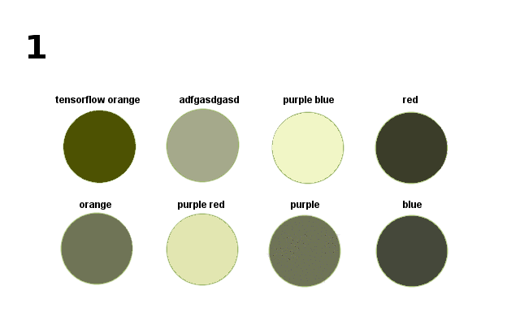
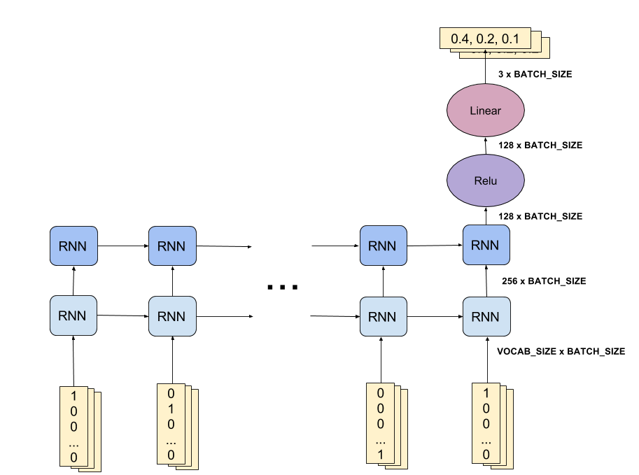
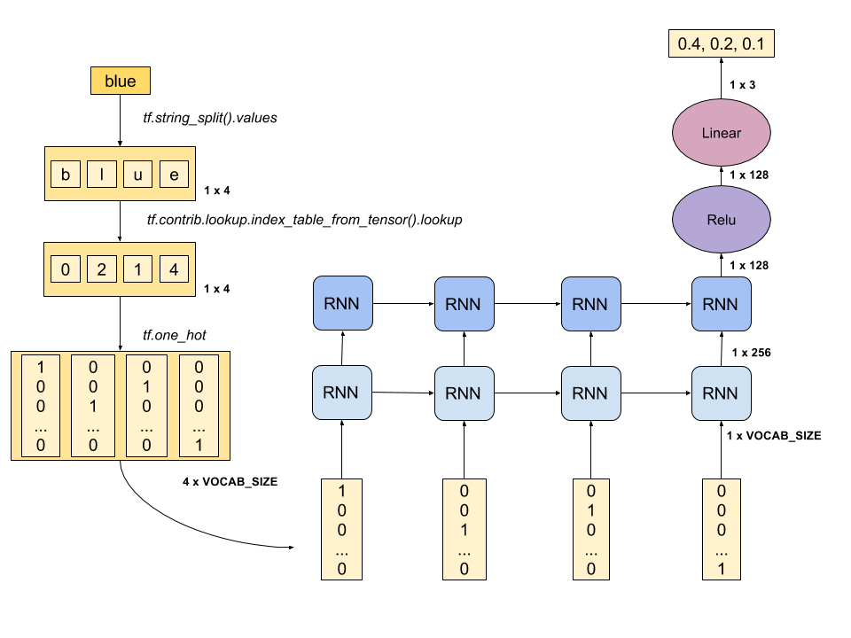

# Colorbot

**Special thanks to [@andrewortman](https://github.com/andrewortman/colorbot/)
that has a repo with a great implementation of colorbot using TensorFlow,
and [@JanelleCShane](http://lewisandquark.tumblr.com/post/160776374467/new-paint-colors-invented-by-neural-network)
that made a nice blog post about given rgb colors generate color names.
These two sources gave us the idea to make a workshop about it!**

The pre-trained model available at pretrained folder was trained on
[this dataset](https://goo.gl/vcBvQ2) which was preprocessed by
[@andrewortman](https://github.com/andrewortman/colorbot/).

## What is Colorbot?

Colorbot is a RNN model that receives a word (sequence of characters) as
input and learns to predict a rgb value that better represents this word.
As a result we have a color generator!



*Check how this gif was generated in [colorbot-keras.ipynb](colorbot-keras.ipynb)

### Keras implementation

You can check a great and simple Keras implementation of this exact same model [here](https://github.com/random-forests/tensorflow-workshop/blob/master/extras/colorbot-keras.ipynb)!

## See ColorBot in action

1. Download the [pretrained model](https://goo.gl/XprbxR) in this path;
2. Extract it in this path;
2. `$ python colorbot.py`

You can also train your own model running:
```shell
# train your own model and then predict values for new color names!
$ python colorbot.py --mode=train --model_dir=/my/path/to/colorbot/saved/model/

# predict values for new color names on a pretrained model
$ python colorbot.py --model_dir=/my/path/to/colorbot/saved/model/
```

## About the model

Here's a diagram of the model built.
The model was trained in a way that given a word (sequence of lower case
characteres) it tries to predict 3 float numbers that represent the
normalized RGB values that more likely represent this word.

### Model



### Execution example



## About the dataset

The data available on this repo was taken from Wikipedia color dataset:

https://en.wikipedia.org/wiki/List_of_colors:_A-F
https://en.wikipedia.org/wiki/List_of_colors:_G-M
https://en.wikipedia.org/wiki/List_of_colors:_N-Z

The format of the dataset that was actually used can be seen
[here](data/test.csv) and more info about how was preprocessed can be seen
[here](data/).

For better results you can train your model in [this bigger dataset](https://goo.gl/vcBvQ2).
